<h1>PS4-PS5游戏机通过局域网翻墙，加速游戏，以及下载游戏教程</h1>
很多小伙伴的PS4不知道怎么代理上网，以至于下载游戏或者什么东西非常慢，于是这篇教程就出来了。

## 相关阅读

  * [PS4-PS5游戏机通过局域网翻墙，加速游戏，以及下载游戏教程](https://github.com/bannedbook/fanqiang/blob/master/game/PS4-PS5%E6%B8%B8%E6%88%8F%E6%9C%BA%E9%80%9A%E8%BF%87%E5%B1%80%E5%9F%9F%E7%BD%91%E7%BF%BB%E5%A2%99%E6%95%99%E7%A8%8B.md)
  * [SStap和Netch免费游戏加速器教程](https://github.com/bannedbook/fanqiang/blob/master/game/SStap%E5%92%8CNetch%E5%85%8D%E8%B4%B9%E6%B8%B8%E6%88%8F%E5%8A%A0%E9%80%9F%E5%99%A8%E6%95%99%E7%A8%8B.md)
  * [Switch、 PlayStation、Xbox等游戏机翻墙教程，利用MAC电脑做旁路由加速](https://github.com/bannedbook/fanqiang/blob/master/game/Switch%E3%80%81%20PlayStation%E3%80%81Xbox%E7%AD%89%E6%B8%B8%E6%88%8F%E6%9C%BA%E7%BF%BB%E5%A2%99%E6%95%99%E7%A8%8B%EF%BC%8C%E5%88%A9%E7%94%A8MAC%E7%94%B5%E8%84%91%E5%81%9A%E6%97%81%E8%B7%AF%E7%94%B1%E5%8A%A0%E9%80%9F.md)
  * [Windows如何共享Wifi无线网卡翻墙热点给其它设备翻墙](https://github.com/bannedbook/fanqiang/blob/master/game/Windows%E5%A6%82%E4%BD%95%E5%85%B1%E4%BA%ABWifi%E6%97%A0%E7%BA%BF%E7%BD%91%E5%8D%A1%E7%BF%BB%E5%A2%99%E7%83%AD%E7%82%B9%E7%BB%99%E5%85%B6%E5%AE%83%E8%AE%BE%E5%A4%87%E7%BF%BB%E5%A2%99.md)
  * [Mac电脑使用ClashX Pro作为网关旁路由给其它设备翻墙](https://github.com/bannedbook/fanqiang/blob/master/game/Mac%E7%94%B5%E8%84%91%E4%BD%BF%E7%94%A8ClashX%20Pro%E4%BD%9C%E4%B8%BA%E7%BD%91%E5%85%B3%E6%97%81%E8%B7%AF%E7%94%B1%E7%BB%99%E5%85%B6%E5%AE%83%E8%AE%BE%E5%A4%87%E7%BF%BB%E5%A2%99.md)
  * [在Mac上使用clashx pro给switch开启游戏加速](https://github.com/bannedbook/fanqiang/blob/master/game/%E5%9C%A8Mac%E4%B8%8A%E4%BD%BF%E7%94%A8clashx%20pro%E7%BB%99switch%E5%BC%80%E5%90%AF%E6%B8%B8%E6%88%8F%E5%8A%A0%E9%80%9F.md)

PS4使用SS或者 v2ray 来代理需要满足2个条件：

一台Windows系统的电脑

当然，你还是得有一台PS4。

**推荐：**  

<strong>配置直接确保你SS帐号在电脑端能正常使用，PS4是使用电脑共享的网络使用SS账号的，PS4使用期间电脑必须开机联网打开SS。并且电脑和PS4必须在一个局域网内（可以理解成使用同一个路由器或者连接同一个 WIFI）。</strong>

首先在电脑的SS客户端里面启用“允许来自局域网的连接”，如下图：

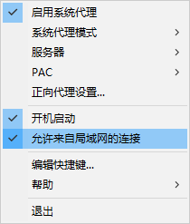

如果是 v2ray：

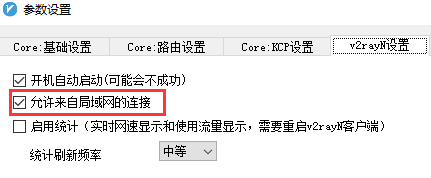

然后查看一下电脑的局域网IP地址。具体做法是用Win键+R 快捷键调出“运行”窗口，在此窗口中输入CMD然后确定，调出命令窗口。在命令窗口中输入ipconfig然后回车。 ipconfig会显示出电脑的IP地址等信息。类似下图，从中可以看到电脑的IP地址。

记住自己电脑的IP之后我们就去PS4配置了。

打开设定：

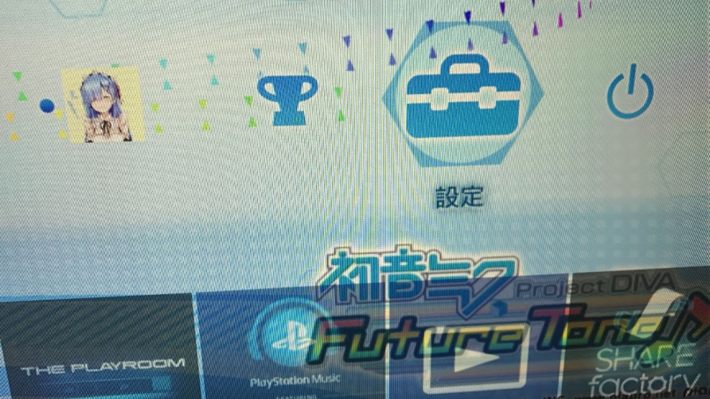

选择网络：

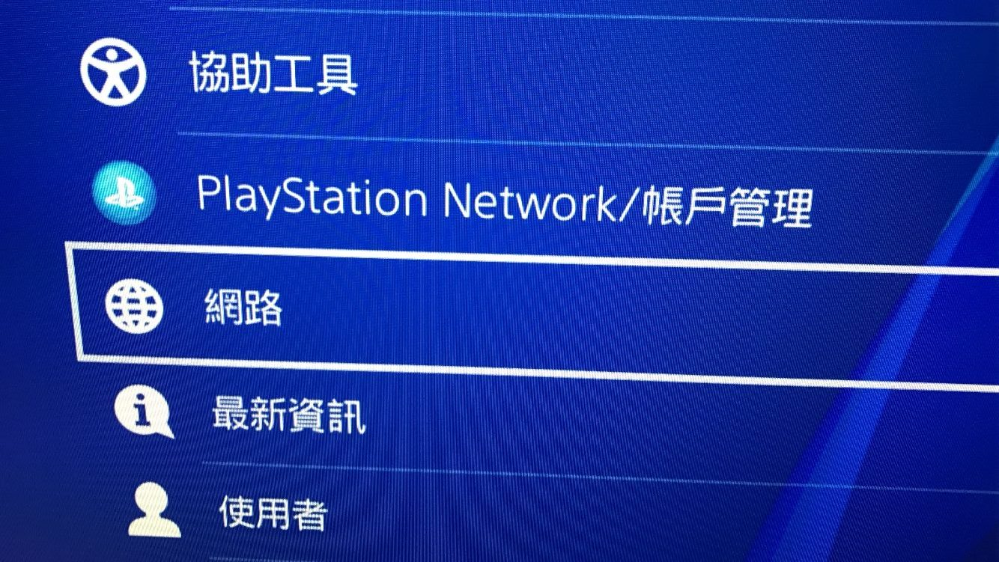

设置网络连接：

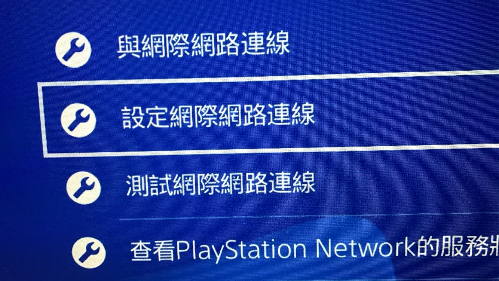

选择使用WIFI（当然你选择LAN也可以，都是一样设置，我这里是连WIFI就演示WIFI的设置方法）

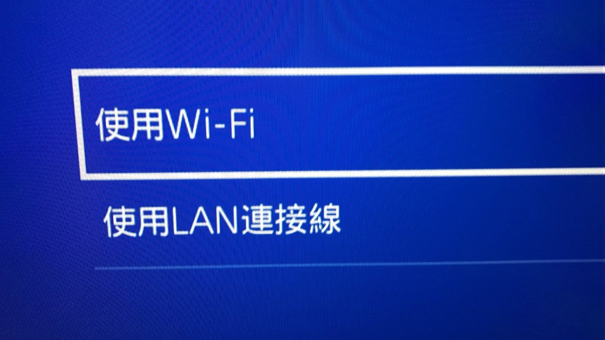

然后选择自定：

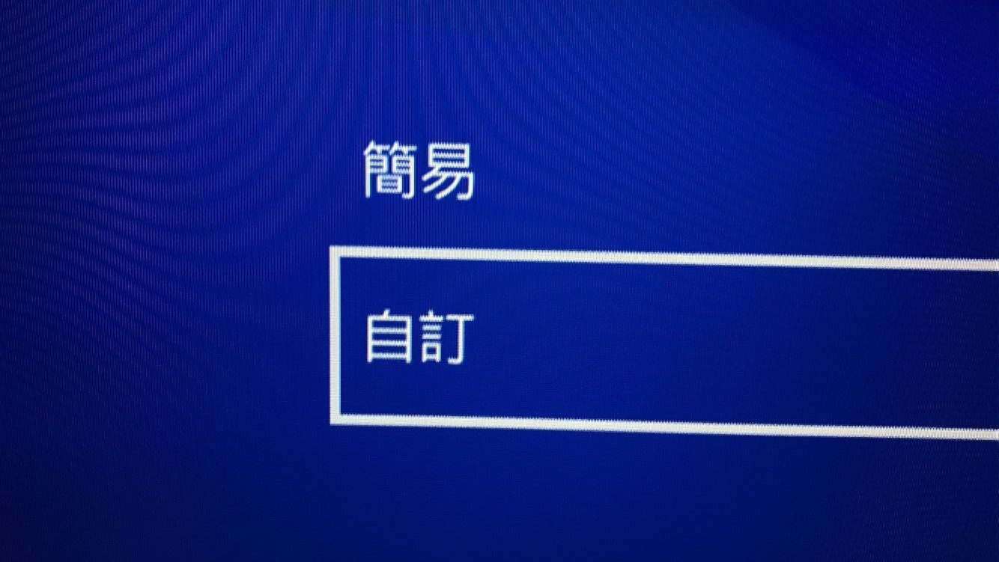

选择你家的WIFI：

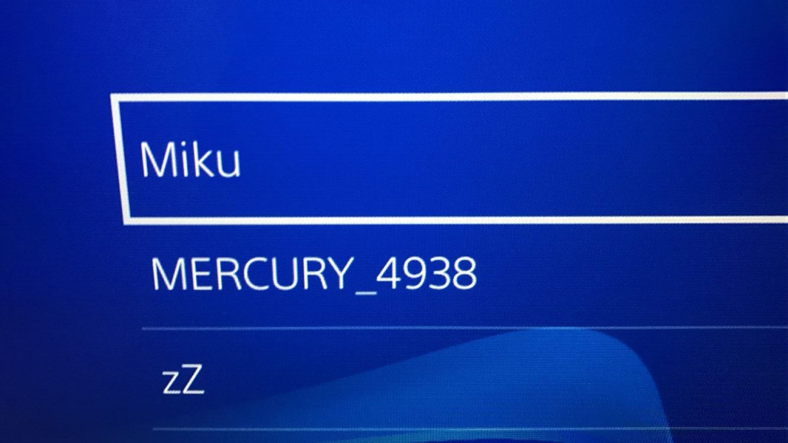

IP地址设定这里选择自动：

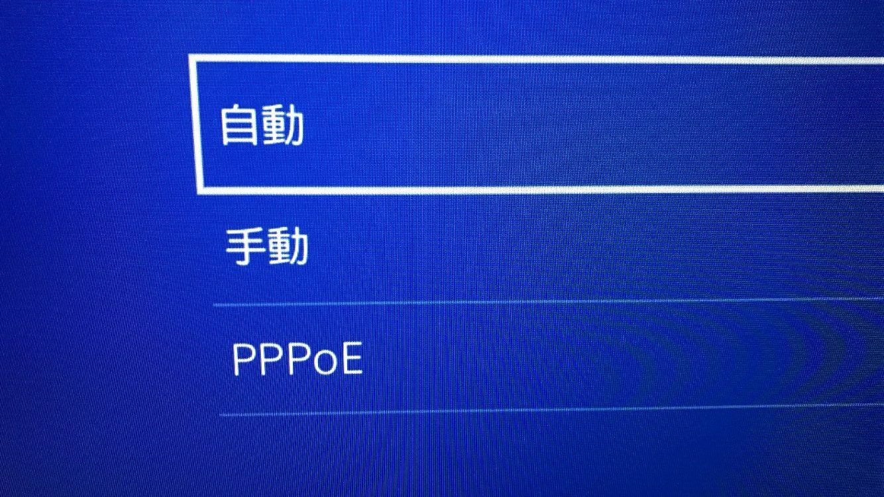

DHCP Host Name这里默认不指定：

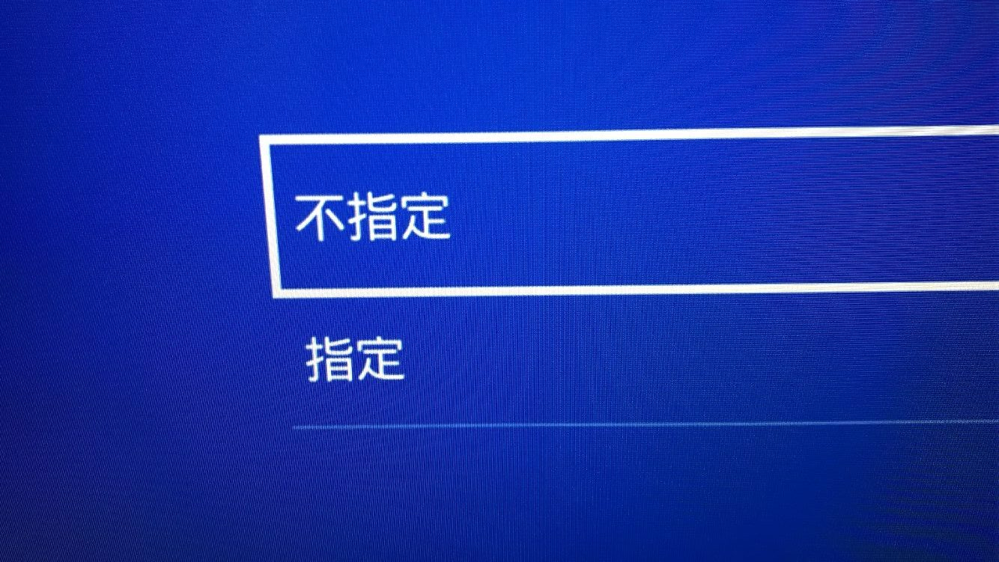

DNS设定也是默认自动：

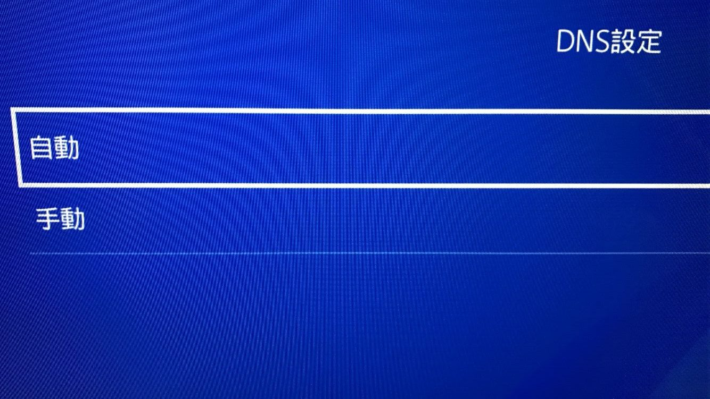

MTU自动：

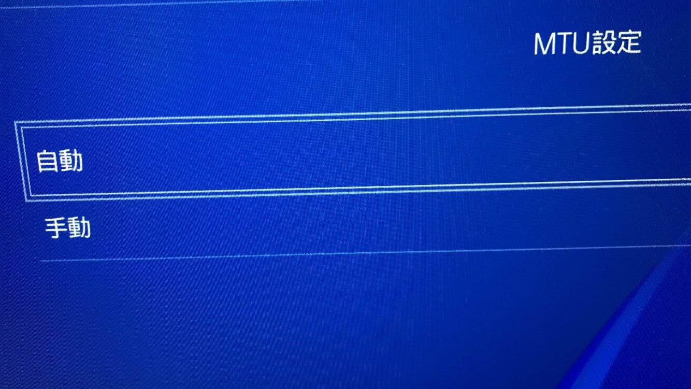

Proxy(代理)服务器这里选择<strong>使用：</strong>

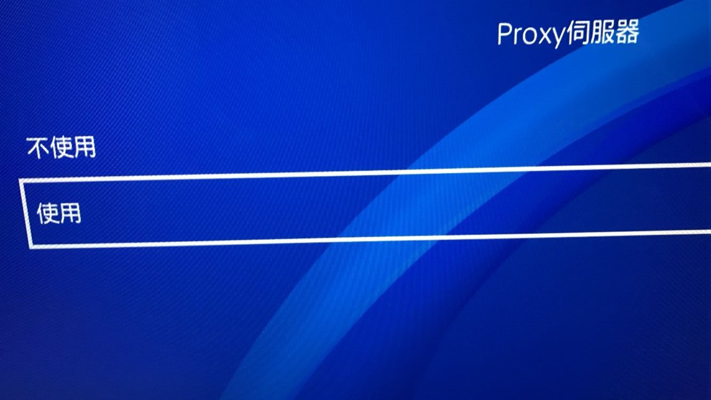

<strong>然后地址填你电脑的IP，前面有说，Port(端口)码填1080，一般默认是1080</strong>，（<strong>如果是 v2rayN，这里应该是10811（具体看V2rayn软件底部状态栏的局域网共享http端口）</strong>）

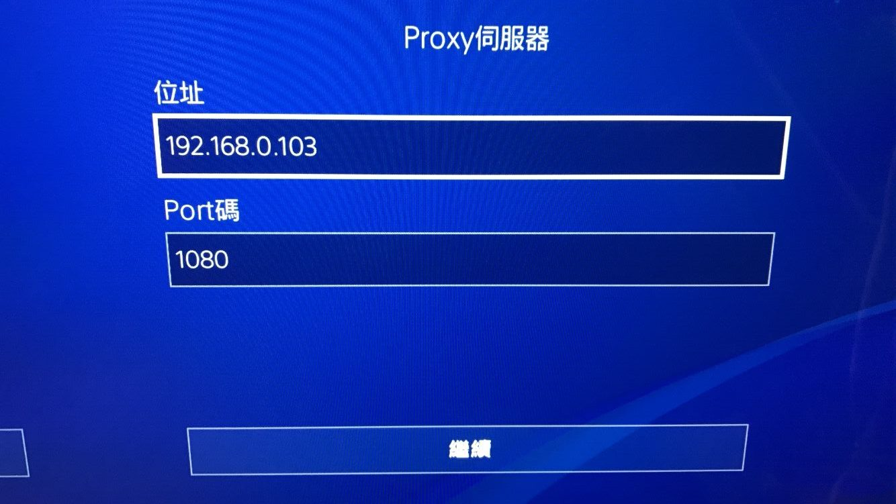

然后点继续，会提示已更新网络设置：

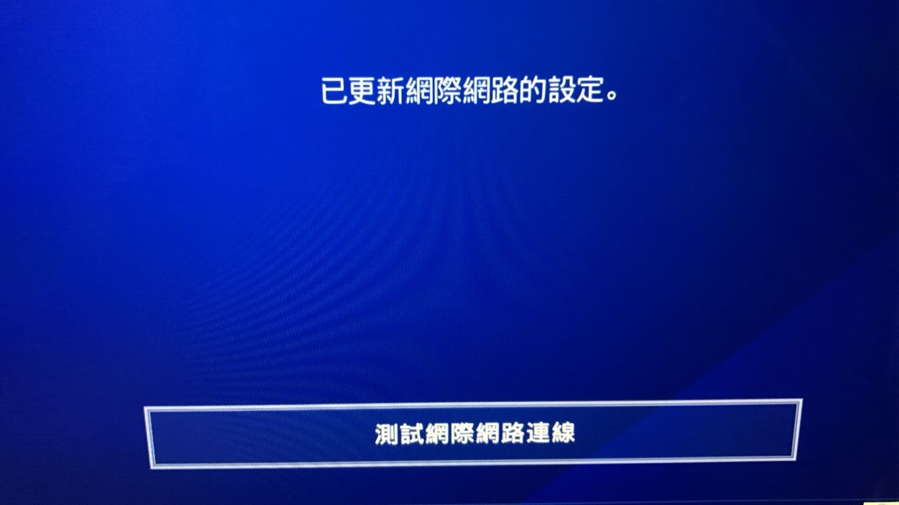

然后测试一下就好了，全部OK就设置完毕了~

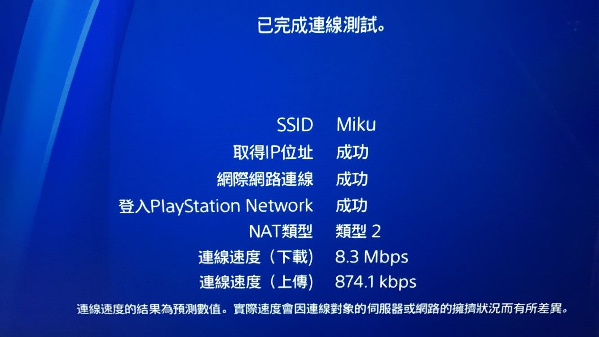

这个时候PS4已经完成代理上网了。

<section>
<ul>
 	<li>

<b>vickygaga</b>

我是路由器梅林固件搞的机场插件… 但是现在psn玩部分联机游戏很容易断连 但是看视频啥的都很顺… 不知道咋办 可能是梯子不太好了

</li>
 	<li>

<b>白乄惜言</b>

请问我clash都按照您的教程测试好了。但是playstation上的YouTube之类的app如何打开呢，是否意味着通过电脑代理这种方法无法打开这种app呢

<ul>
 	<li>

对的，通过这种方式设置的是 HTTP 代理，而 PS 里的 App 不走 HTTP 代理，除非把代理部署在路由器层面，或者 App 里面支持设置代理（YouTube 不行）。

<ul>
 	<li>

<b>白乄惜言</b>

十分感谢您的回复！其实我想看Netflix，不知道网飞可不可以app里面设置代理

<ul>
 	<li>

应该也不行，可以去看看路由器配置代理的教程，一般来讲都要给路由器刷机，梅林或者 OP 系统

</li>
</ul>
</li>
 	<li>

<b>白乄惜言</b>

好的！再次十分感谢您的回复！

</li>
 	<li>

<b>Avery</b>

呜呜～我说我突然想起试试，主要是以前用来做三级route被我用来做ap了，ps4 23年了ipv6也不支持，恼。sock端口设置完，发现浏览器没任何问题，打开应用结果提示我网络不可用。原来是这回事。太wwww了，

</li>
</ul>
</li>
</ul>
</li>
 	<li>

<b>恩师马保国</b>

您好，通过V2ray按照设置在ps4上可以打开google网页，也可以在网页中打开YouTube，客户端连接不上奈飞和YouTube也可以理解，但是我在配置完代理ip和端口号之后，点击测试网络时，其中倒数第二项“下载”显示失败，“上传”显示有网速，其余都是成功，不太理解为啥“下载”提示失败。

<ul>
 	<li>

可能跟代理的质量有关系，也可能当时的网络有问题（丢包），测试怎么样无所谓，实际能打开就可以了

</li>
</ul>
</li>
 	<li>

<b>芜湖飞行员</b>

连是连上了，但感觉没任何作用啊。首先这玩意不能给游戏加速取代加速器。其次不能用youtube这些外网APP，最后下载速度比普通直连慢太多…百度的时候我还以为这玩意可以让我PS4直接游戏加速和上youtube呢

<ul>
 	<li>

</li>
 	<li>

<b>Adamyou</b>

帮站长分担解答任务。XD
clash代理可以解决游戏下载速率和ps store观看游戏简介视频因网速卡顿的问题。当然前提是你的机场够带宽和你的流量够。我想一个月几十块几百g应该都负担得起吧。下载速度还不如直连的话不是节点问题就是机场本身带宽。

</li>
</ul>
</li>
 	<li>

<b>Adamyou</b>

能不能出一个playstaion可以使用SSR代理app（例如youtube，Netflix）的教程? 他们不走http端口，用PC的clash代理无效

<ul>
 	<li>

要想 PS4 上的 App 走代理，需要在路由器就支持代理，路由器刷个梅林固件，配置一下就可以了，网上应该也有对应的教程，我这属实是没有多余的路由器来做教程了

<ul>
 	<li>

<b>Adamyou</b>

感谢站长回复。我从Google搜索clash代理范例到此，本没指望会收到解答。感谢你。非常感谢。我一直在想办法解决大屏上看流媒体的方法，国内Android机顶盒无法安装Netflix，playstaion应该是较好的解决办法了。

</li>
</ul>
</li>
</ul>
</li>
 	<li>

<b>thx</b>

谢谢大佬的教程，终于不用另外搞加速器玩PS4的游戏了，不过用v2rayN的人软件界面端口默认是1080的话要设置成1081才行，SS还是1080，连不上的试试

<ul>
 	<li>

对的，要看 HTTP 端口

</li>
</ul>
</li>
 	<li>

v2ray不行
clash彳亍！
v2ray可能是端口问题吧

<ul>
 	<li>

可能是端口的问题，换 HTTP 端口

<ul>
 	<li>

<b>kingsleyjin</b>

请问我用clash代理成功了，ps4网页浏览器能正常登陆Netflix，YouTube但应用就不行请问是什么原因

<ul>
 	<li>

YouTube 不走 HTTP 代理，你这种情况建议使用路由器FQ

</li>
</ul>
</li>
</ul>
</li>
 	<li>

<b>ddr</b>

我家用的也是clash，怎么设置呀？

</li>
</ul>
</li>
 	<li>

<b>麻</b>

v2ray默认监听确实是10808，但ps4不认socks端口，报错未知socks67，得走http，端口号要加一，也就是10809

<ul>
 	<li>

没错

</li>
</ul>
</li>
 	<li>

<b>uyi</b>

MAC的ShadowsocksX没有允许来自局域网的链接怎么办？

<ul>
 	<li>

那无了

</li>
</ul>
</li>
 	<li>

<b>BBBB</b>

你好大佬，我的ss里面没有允许来自局域网的链接，只有允许其他设备连入呢？我该怎么弄

<ul>
 	<li>

一样的意思

</li>
</ul>
</li>
 	<li>

<b>ku1</b>

成功了谢谢，自己有小火箭却不知道怎么共享给ps4，还去额外花钱买uu。谢谢分享

</li>
 	<li>

<b>kahnss</b>

用的SSR，开了允许来自局域网的连接，端口也是1080，按照步骤设置了ps4，但依然无法连上服务器

<ul>
 	<li>

可能没领悟到文章精髓，建议重新看一遍

</li>
</ul>
</li>
 	<li>

<b>hlo</b>

共享后手机可以登陆网页，ps4无法正常连接游戏网络，这是什么导致的，要怎么处理？感谢解答

<ul>
 	<li>

网页是走 HTTP 代理，游戏走 UDP，可以谷歌搜一下 UDP 代理。

</li>
</ul>
</li>
 	<li>

<b>jkxvzn</b>

我路由器可以设置vpn，可是要vpn地址和账号密码，这怎么输

<ul>
 	<li>

此 VPN 非彼 VPN

</li>
</ul>
</li>
 	<li>

<b>vio</b>

配置了，网络正常，浏览器也能访问谷歌，但还是上不了PSN。

<ul>
 	<li>

那不清楚，我好像可以正常连通 PSN 的

</li>
</ul>
</li>
 	<li>

<b>Jony619</b>

看了评论，这样设置既不能给PS4加速、也不能看奈飞youtube，那具体有啥用啊？我PC端用V2ray，主页面“端口”显示16668，怎么试都无法成功连网…

<ul>
 	<li>

可以加速下载和更新

</li>
</ul>
</li>
 	<li>

<b>123bubu</b>

V2ray在PS4连好了进不去YouTube为什么?

<ul>
 	<li>

因为YouTube属于APP，不走HTTP代理。

</li>
</ul>
</li>
</ul>
</section>

转载自：<a href="https://mikublog.com/tech/609">PS4使用Shadowsocks / V2Ray代理上网，加速游戏，以及下载游戏</a>
